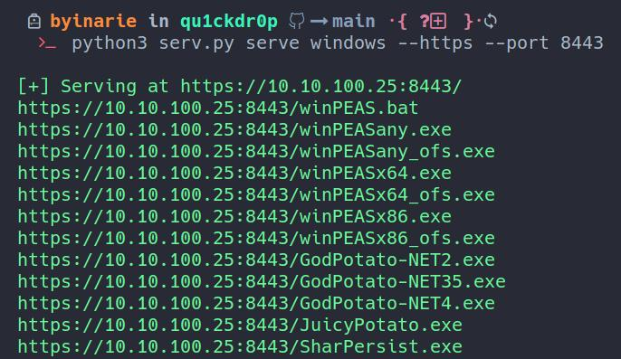
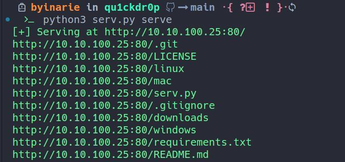
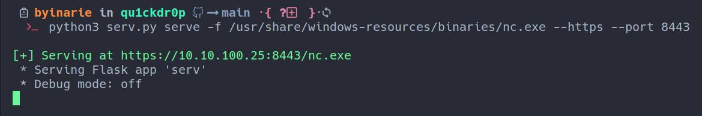
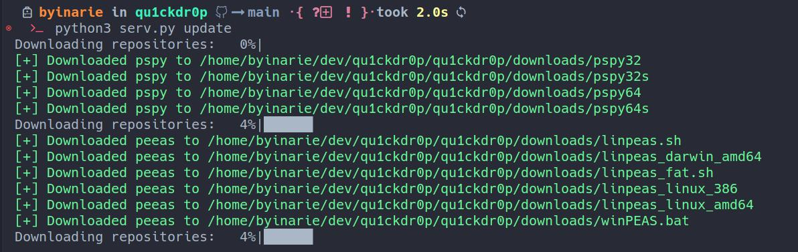

<h1 align="center">
    
</h1>

<h4 align="center">Rapidly host payloads and post exploitation bins over http or https.</h4>
<h6 align="center">Designed to be used on exams like OSCP / PNPT or CTFs HTB / etc.</h4>
<h6 align="center">Pull requests and issues welcome. As are any contributions.</h4>
<h6 align="center">Batteries included.</h4>


<p align="center">
  <a href="#install">Install</a> •
  <a href="#install">About</a> •
  <a href="#examples">Examples</a> •
  <a href="#license">License</a>
</p>

## About
Host files fast using aliases, specify a directory (-d), or specify a file (-f). Set serv.py as an alias to use it anywhere. Supports hosting over http or https. If https is chosen it will generate a certificate and use it automatically. The interface is chosen by priority, if tun0 is up then tun0 will be used, otherwise it will use eth0. Download tooling to serve or set your own aliases using the ini files. Downloads require a github API token.

Qu1ckdr0p comes with some tools in windows/ and linux/ by default, along with some default repos in config/repos.ini. Not all of the default tools have compiled binaries released in their source code repos (e.g: ghostpack) so compiled ones are included without the release repo added. Running `serv.py update` (requires github api key) will reach out to the repos configured in config/repos.ini, download them, and move them into the correct platform directory. All of the tools in the qu1ckdr0p repo and all of the Kali default tools (or most of them) also have a built in alias.

## Install
```zsh
git clone https://github.com/byinarie/qu1ckdr0p.git /opt/qu1ckdr0p
cd /opt/qu1ckdr0p/ 
poetry install
sudo apt install kali-tools-windows-resources
sudo apt install kali-tools-post-exploitation
alias serv="python3 /opt/qu1ckdr0p/serv.py" (or add to ~/.zshrc)
```

## Examples 

### Basic usage
#### Defaults to http:80

```zsh
serv.py serve -d /path 
serv.py serve -d /path --https --port 443
serv.py serve -f /path/file.bin --https --port 443
serv.py serve linux --https --port 443
serv.py serve windows --https --port 443
serv.py serve seatbelt --https --port 443
serv.py serve mimikatz --https --port 443
serv.py list --search "mimikatz"
serv.py list
```

### Serve a windows privledge escalation directory over HTTPS 8443

```zsh
serv.py serve windows --https --port 8443
# Pre configured post windows directory is: ./windows = /windows
# see: config/common.ini
```
<p>

### Serve the working directory

```zsh
serv.py serve 
```
<p></p>

### List currently configured aliases and search for a specific bin

```zsh
serv.py serve list --search winpeas
serv.py serve list 

```

<p>


### Serve a single file over HTTPS 8443

```zsh
serv.py serve -f /usr/share/windows-resources/binaries/nc.exe --https --port 8443
```
<p><p>


### Serve a directory over default

```zsh
serv.py serve -d /usr/share/windows-resources/binaries
```
<p></p>

### Download default tools
#### First add your github api token to config/settings.ini
#### Modify config/repos.ini as needed

```zsh
serv.py update
```
<p></p>


## License

MIT

---

